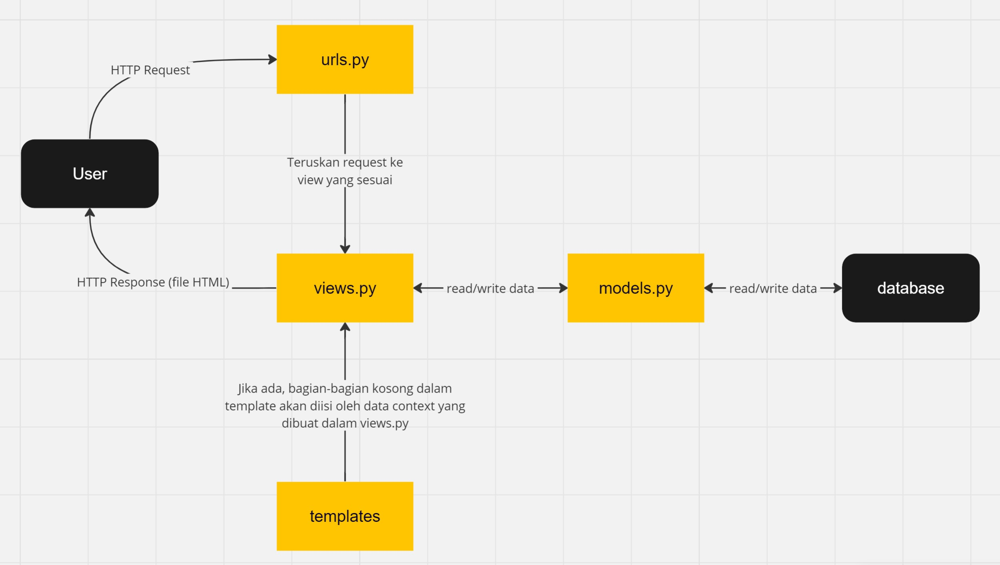
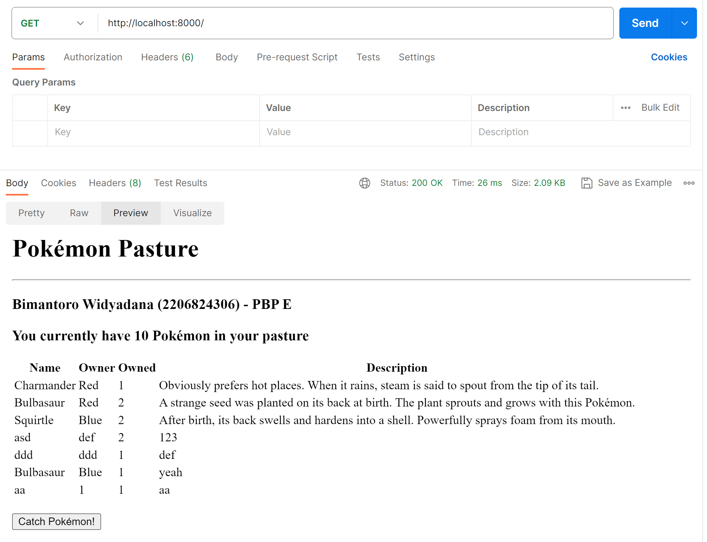
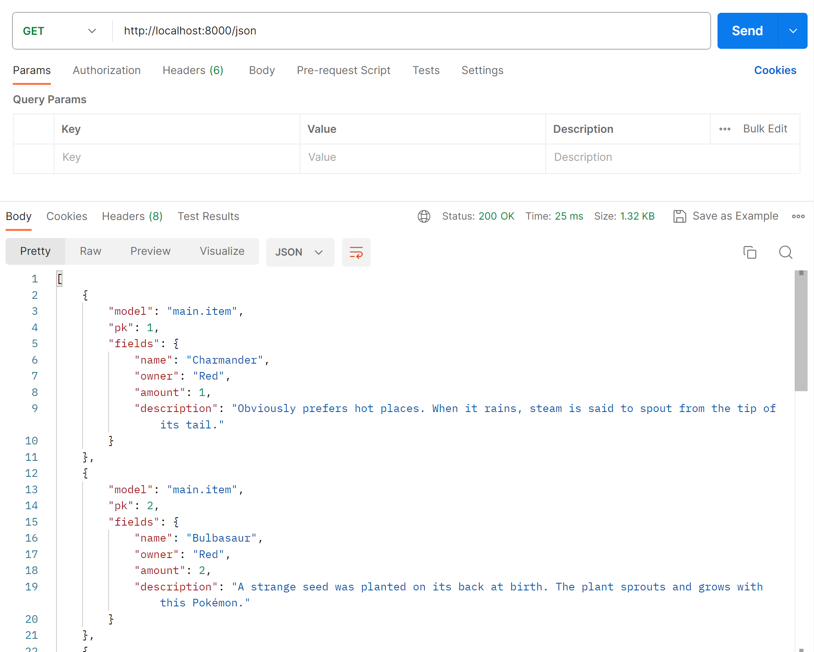
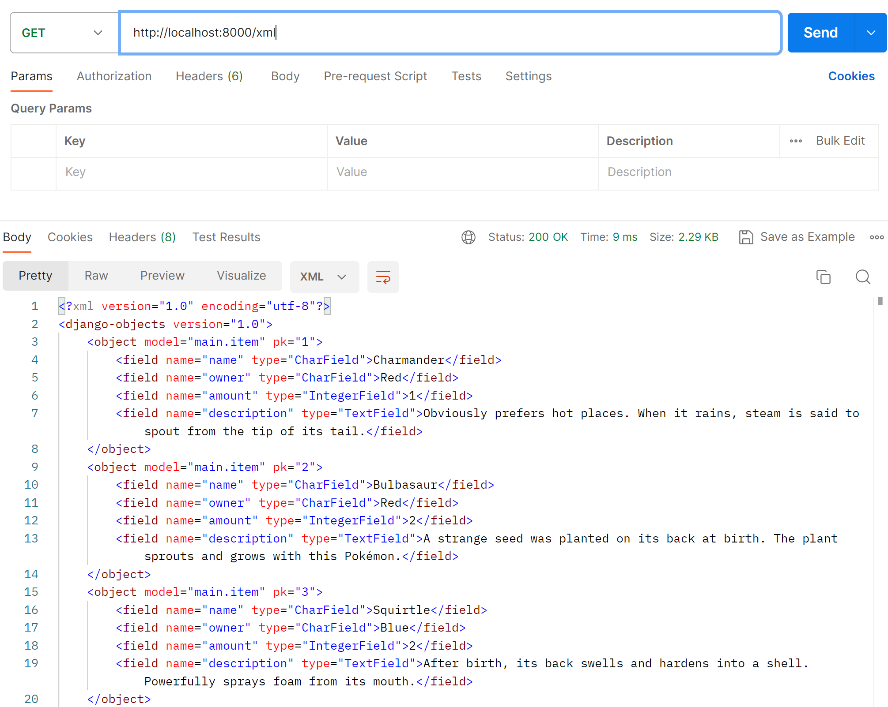
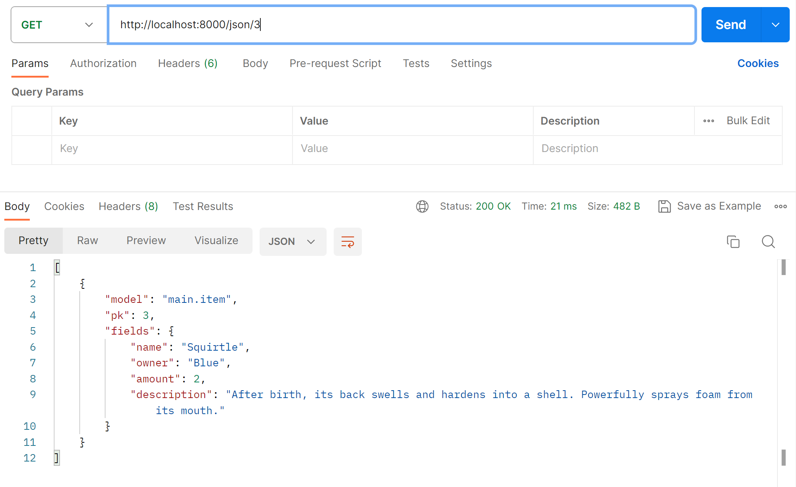
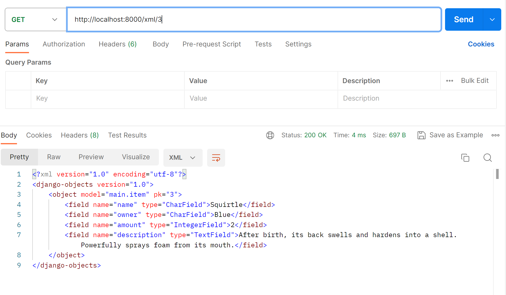

# Tugas 2

### Cara pengimplementasian *checklist*
1. Untuk membuat *project* saya, saya menjalankan *command* `django-admin startproject pokemon_pasture`. *Command* ini akan menghasilkan kode awal yang dibutuhkan untuk memulai *project* Django. Setelah itu, di *file* `settings.py`, tambahkan `'*'` pada `ALLOWED_HOSTS`
2. Untuk membuat aplikasi *main*, saya menjalankan *command* `python manage.py startapp main`. *Command* ini akan menghasilkan struktur direktori dasar dari suatu aplikasi. Setelah membuat aplikasi, kita perlu mendaftarkannya ke proyek dengan cara menambahkan `main` ke `INSTALLED_APPS` di `settings.py` dalam `pokemon_pasture`
3. Untuk melakukan *routing* ke aplikasi *main*, buat sebuah file bernama `urls.py` di dalam direktori `main`. Dalam *file* tersebut, import `path` dari `django.urls` dan import fungsi dari `views.py` untuk menampilkan *template* `main.html`. Setelah itu, buat sebuah variabel bernama `urlpatterns` yang akan berupa sebuah *list*, kemudian isi *list* dengan `path('', show_main, name='main')`. Kode ini akan memanggil fungsi `show_main` apabila ada seorang *user* yang mencoba mengakses `https://pokemon-pasture.adaptable.app/main`. Setelah dipanggil, `show_main` akan mengembalikan template `main.html` untuk ditampilkan ke *user*.
4. Buka *file* `main/models.py` dan buat sebuah *class* baru bernama `Item` yang meng-*inherit* dari `models.Model`. Kemudian, buat atribut `name` dengan tipe `CharField` dan `max_length=255`, atribut `amount` dengan tipe `IntegerField`, dan atribut `description` dengan tipe `TextField`. Selain ketiga atribut di atas, saya juga menambahkan atribut `owner` dengan atribut `CharField` dan `max_length=255` untuk merepresentasikan pemilik dari sebuah *pokemon*. Setelah *model* dibuat, kita perlu menjalankan `python manage.py makemigrations` dan `python manage.py migrate` untuk meng-*update* basis data proyek kita.
5. Pada `main/views.py`, import `render` dari `django.shortcuts` dan import `Item` dari `.models`. Kemudian, buat sebuah fungsi dengan nama bebas dan satu argumen `request` yang merepresentasikan HTTP *request* dari *user*, di sini saya menamakan fungsinya `show_main`. Fungsi ini akan mempersiapkan semua data yang diperlukan sebelum memberi data tersebut ke `main.html` sekaligus menampilkannya. Untuk memberi datanya ke *file* html, kita gunakan sebuah *dictionary* yang pada nantinya dapat diakses dari *file* html kita. Setelah membuat *dictionary*-nya, kita dapat me-*render* html-nya dengan mengembalikan `render(request, 'main.html', context)`. Argumen pertama dari `render` merupakan HTTP *request* dari *user*, argumen kedua merupakan *file* html yang ingin ditampilkan, dan argumen terakhir merupakan data yang ingin kita berikan kepada *file* html tersebut.
6. Setelah menambahkan *url* `main/` di level aplikasi, kita perlu menambahkan *url* ini di level proyek. Untuk melakukan hal itu, kita perlu pergi ke *file* `urls.py` di *folder* `pokemon_pasture` dan menambahkan `path('main/', include('main.urls'))` di variabel `urlpatterns`. Jangan lupa untuk meng-*import* `include` dari `django.urls` terlebih dahulu.
7. Untuk men-*deploy* ke Adaptable, kita perlu membuat *repository* di GitHub terlebih dahulu. Setelah membuatnya, kita perlu mem-*push* kode kita ke *repository* itu. Jangan lupa untuk membuat file `.gitignore` agar *file* yang tidak diperlukan tidak ikut di-*push*. Kemudian, *log in* ke Adaptable.io dengan akun GitHub kita. Setelah itu, hubungkan *repository* GitHub kita ke Adaptable dan buat *app* baru di Adaptable dengan memilih proyek GitHub kita. Selanjutnya, pilih *Python App Template* untuk *template*-nya dan PostgreSQL untuk basis datanya. Kemudian, sesuaikan versi Python-nya dengan versi Python yang kita gunakan untuk mengembangkan proyek kita. Terakhir, pada *start command*, gunakan *command* `python manage.py migrate && gunicorn pokemon_pasture.wsgi`. Masukkan nama aplikasi dan centang *HTTP Listener Port* sebelum men-*deploy*.

### Bagan *request-response* Django

1. HTTP *request* dari *user* akan ditangkap oleh `urls.py`
2. Kemudian, fungsi `show_view` yang kita masukkan dalam `path('path/', show_view, name='view')` akan dipanggil
3. Apabila diperlukan, dalam fungsi itu, kita dapat mengambil data dari basis data kita melalui kelas-kelas dalam `models.py`.
4. Data-data ini kemudian dapat kita tampilkan dalam *file* html `template` kita dengan cara membuat sebuah *dicrionary* `context`.
5. Setelah semua persiapan selesai, `show_view` akan mengembalikan `render(request, '<filename>.html', context)` untuk menampilkan *file* html yang sudah sesuai kepada *user*.

### Mengapa kita perlu *virtual environment*?
*Virtual environment* merupakan suatu cara untuk mengisolasi proyek Python kita dari instalasi Python global dan dari proyek Python yang lainnya. Dalam setiap *virtual environment*, kita dapat memiliki versi Python yang berbeda serta memiliki *package* dan *dependencies* yang berbeda juga. Karena kita seringkali ingin membuat banyak proyek Django dalam satu komputer yang membutuhkan versi Python dan *package/dependencies* yang berbeda-beda, penggunaan *virtual environment* sangat direkomendasikan apabila kita ingin mengembangkan proyek Django. Walaupun demikian, kita tetap saja dapat membuat proyek Django tanpa *virtual environment*. Namun, ini sangat tidak disarankan karena alasan-alasan yang telah disebut di atas. Tanpa *virtual environment*, kita tidak bisa memisahkan tiap proyek Django kita ke dalam lingkungannya masing-masing yang rapi dan bersih. Selain itu, jika kita ingin membuat proyek baru yang menggunakan versi Python atau *package/dependencies* yang berbeda dengan proyek kita yang terakhir, itu akan menjadi sangat rumit karena kita harus meng-*uninstall* versi yang lama terlebih dahulu baru meng-*install* versi yang baru. Dengan *virtual environment*, kedua versi tersebut dapat hidup di lingkungannya masing-masing tanpa mengganggu satu sama lain.

### Pengertian MVC, MVT, dan MVVM, serta perbedaannya
MVC (Model-View-Controller), MVT (Model-View-Template), dan MVVM (Model-View-ViewModel) merupakan pola arsitektur pengenmbangan *software*. Pola arsitektur ini berguna untuk memisahkan logika bisnis dengan tampilan pengguna. Pola arsitektur memberikan modularitas pada *file* proyek dan memastikan bahwa semua kode tercakup dalam *unit testing*. Hal ini memudahkan seorang *developer* untuk memelihara aplikasi dan memperluas fitur aplikasi di masa depan.
1. MVC (Model-View-Controller)
   1. Model:
   Komponen ini menyimpan data aplikasi. Komponen ini tidak memiliki pengetahuan mengenai tampilan pengguna. Komponen ini bertanggungjawab atas penanganan *domain logic* dan komunikasi dengan *database*
   2. View:
   Komponen ini adalah komponen *user interface*. Komponen ini menyediakan visualisasi data yang disimpan dalam model dan menawarkan interaksi kepada pengguna.
   3. Controller:
   Komponen ini adalah komponen yang menjembatani *model* dan *view*. Komponen ini mengendalikan aliran data ke *model* dan memperbarui *view* apabila ada data yang berubah.
2. MVT
   1. Model:
   Sama seperti *model* di MVC, *model* di MVT berguna untuk menyimpan data aplikasi. Komponen ini juga menangani komunikasi dengan *database*
   2. View:
   *View* dalam MVT mirip dengan *controller* di MVC. *View* menjalankan logika bisnis, berinteraksi dengan *model*, dan merender template. *View* merupakan jembatan antara *model* dengan *template*. *View* menerima permintaan HTTP dan kemudian mengembalikan respons HTTP.
   3. Template:
   *Template* adalah komponen yang membuat MVT berbeda dari MVC. *Template* bertindak sebagai lapisan presentasi dan pada dasarnya adalah kode HTML yang merender data. Konten dalam *file* ini dapat bersifat statis atau dinamis.
3. MVVM
   1. Model:
   Sama seperti MVC dan MVT, komponen *model* berguna untuk menyimpan data aplikasi. Dalam MVVM, *model* dan *viewmodel* bekerja sama untuk mendapatkan dan menyimpan data.
   2. View:
   Komponen *user interface*. *View* akan memberitahukan *ViewModel* mengenai tindakan-tindakan yang dilakukan *user* agar data aplikasi dapat di-*update* apabila ada perubahan.
   3. ViewModel:
   *ViewModel* mengekspos data-data yang relevan bagi *view*. Selain itu, jika *user* melakukan sesuatu seperti meng-input data, *ViewModel* akan meng-*update* komponen model. *ViewModel* mirip dengan komponen *controller* di MVC dan *view* di MVT.

# Tugas 3
### Perbedaan `GET` dan `POST`
Secara umum, `GET` digunakan untuk mengirim permintaan ke server untuk meminta data atau *resource* sedangkan `POST` digunakan untuk mengirim permintaan ke server untuk membuat data baru. Adapun beberapa perbedaan lainnya adalah sebagai berikut.
|GET|POST|
|---|---|
|Data dikirim melalui URL sebagai *parameter query*|Data dikirim melalui *request body* yang tidak dapat dilihat dari URL  |
|Bersifat aman karena tidak memiliki efek samping terhadap server dan data|Tidak bersifat aman karena dapat mengubah data di server|
|Bersifat *idempotent* karena tiap permintaan seharusnya mengembalikan hasil yang sama|Tidak bersifat *idempototent* karena melakukan permintaan yang sama berkali-kali dapat mengakibatkan pembuatan data yang tidak diinginkan|
|Biasanya digunakan untuk mengambil halaman web, gambar, atau *resource* lainnya dari server.|Biasanya digunakan untuk mengirimkan form, meng-*upload* file, atau membuat perubahan pada data server.|

### Perbedaan antara XML, JSON, dan HTML
JSON dan XML merupakan sebuah *data interchange format* yang digunakan untuk pertukaran informasi antar aplikasi. JSON dan XML dapat memecah sebuah struktur data menjadi bentuk yang dapat dikirim dan terima berbagai aplikasi dengan mudah. Sementara itu, HTML lebih sering digunakan untuk membuat halaman web dan merender konten di browser. Secara umum, HTML biasanya tidak digunakan untuk pertukaran data meskipun HTML dapat membawa beberapa metadata dan data terstruktur dalam *file*-nya.

Perbedaan utama antara JSON dan XML terletak pada sintaksnya. Sesuai namanya, JSON menggunakan sintaks objek dan *array* yang mirip dengan sintaks JavaScript. JSON menggunakan sintaks sederhana yang terdiri dari *key-value pairs*, di mana *key*-nya berupa *string* dan *value*-nya dapat berupa *string*, angka, objek, *array*, *boolean*, atau *null*. Sementara itu, sintaks XML mirip dengan sintaks HTML. XML menggunakan *tags* untuk mendefinisikan struktur dari data di dalamnya. *Tags* berguna untuk menyimpan elemen di dalamnya. Sedangkan elemen sendiri adalah representasi dari data yang ingin dikirim. Elemen dapat di-*nest* dalam elemen lain untuk menciptakan sebuah struktur hierarki. Karena XML menggunakan *tags*, XML cenderung lebih susah untuk dibaca dan ditulis dibanding JSON karena *tags* tersebut dapat terasa berantakan untuk dilihat.

### Mengapa JSON sering digunakan?
- JSON memiliki *native support* dari JavaScript, bahasa yang sekarang sering sekali digunakan dalam *web development*. Karena ini, JavaScript dapat mem-*parse* data JSON dengan mudah dan struktur data JSON hampir identik dengan objek dan *array* JavaScript.
- JSON sederhana dan mudah dibaca. Seperti yang telah dijelaskan pada bagian sebelumnya, JSON menggunakan *key-value pairs* untuk menstruktur datanya sehingga membuatnya mudah untuk dibaca, ditulis, dan dipahami.
- JSON bersifat *lightweight*. JSON tidak mengandung metadata atau hal lainnya yang tidak diperlukan sehingga muatan JSON lebih kecil dan dapat mengurangi *bandwith* dan meningkatkan *performance*.

### Cara pengimplementasian *checklist*
1. Untuk membuat input form, saya pertama-tama membuat *file* baru  `main/forms.py`. Kemudian, saya membuat *class* baru dengan nama `PokemonForm` yang merupakan *subclass* dari `django.forms.ModelForm`. Setelah itu, saya membuat *class* `Meta` di dalam *class* `PokemonForm` untuk memberi tahu formnya model apa yang akan digunakan untuk menyimpan input dari *user* dan *field* apa saja yang nanti akan ditampilkan ke *user*.
Kemudian, di `main/views.py`, saya membuat fungsi baru untuk menampilkan form. Di dalam fungsi tersebut, saya mengecek terlebih dahulu apakah Pokémon yang diinput *user* sudah ada di *databse* atau belum. Jika sudah ada, program akan mengambil data Pokémon tersebut dari *database* dan meng-*increment* atribut `amount`-nya sebanyak satu kali. Jika belum ada, program akan membuat *record* baru dalam *database* yang berisi Pokémon baru.
Selanjutnya, jangan lupa untuk membuat *file* HTML baru yang merupakan halaman formnya sendiri. HTML memiliki *tag* `form` yang dapat digunakan untuk membuat form. Selain itu, Django juga memiliki fitur di mana objek `Form` dapat ditampilkan di HTML sebagai tabel dengan `form.as_table`. Terakhir, buat sebuah tombol untuk mensubmit input dari *user*.
Setelah itu semua selesai, lakukan *routing* ke halaman form agar dapat diakses dari web. Proses *routing* sama seperti proses *routing* di tugas 2.
2. Pengimplementasian *views*
   - HTML\
Pertama-tama, ambil data dari *databse* dengan `Item.objects.all()` dan simpan pada sebuah variabel, katakan `items`. Setelah itu, masukkan variabel `items` pada *dictionary* `context` agar nantinya dapat diakses dari HTML. Selain itu, kita juga dapat menampilkan total jumlah *item* dengan *for loop*. Gunakan kode `items.values_list(amount)` untuk mendapatkan *list* atribut jumlah dari tiap data. Kemudian, gunakan *for loop* untuk me-*loop* semua data di *list* dan menambahkannya ke variabel `total`. Saat me-*loop* tiap data, gunakan index ke-0 dari data untuk menambahkannya ke jumlah total karena tiap data di `items.values_list(amount)` merupakan sebuah tuple dan nilai jumlahnya sendiri ada di index ke-0. Setelah selesai, masukkan variabel `total` ke *dictionary* `context` juga.\
Kemudian, dari sisi HTML, kita dapat mengakses data tersebut dengan menggunakan `{{ }}`. Sebagai contoh, variabel `total` dapat diakses dan ditampilkan di HTML dengan `{{ total }}`. Kemudian, untuk menampilkan data dalam *list* `items`, kita dapat melakukan *for loop* di HTML. *For loop* dilakukan dengan ``. Selanjutnya, kita dapat mengakses atribut dari `item` sebagaimana halnya kita mengakses atribut dengan Python. Sebagai contoh, jika kita ingin mengakses atribut nama, kita gunakan `{{ item.name }}`. Data *item* dapat ditampilkan dengan menggunakan *tag* `<table>` di HTML.
   - XML
   Pada `main/views.py`, import `HttpResponse` dari `django.http` dan `serializers` dari `django.core`. Kemudian, buat fungsi baru. Di dalamnya, ambil data dari *database* dengan `Item.objects.all()` dan kemudian simpan dalam variabel `data`. Setelah itu, kembalikan `HttpResponse(serializers.serialize("xml", data), content_type="application/xml")`.
   - JSON\
   Proses mengembalikan JSON sama seperti XML, kecuali di bagian terakhir. Untuk JSON, kembalikan `HttpResponse(serializers.serialize("json", data), content_type="application/json")`
   - XML by ID\
   Buat fungsi yang selain menerima argumen `request`, juga menerima argumen `id`. Kemudian, data diambil dari *database* berdasarkan ID *primary key*-nya. Hal itu dilakukan dengan `Item.objects.filter(pk=id)`. Kemudian, kembalikan HTTP response seperti biasa dengan `HttpResponse(serializers.serialize("xml", data), content_type="application/xml")`
   - JSON by ID\
   Proses sama seperti XML by ID, tetapi kembalikan response dalam bentuk JSON, yaitu `HttpResponse(serializers.serialize("json", data), content_type="application/json")`
3. Untuk melakukan *routing*, pertama-tama *import* semua fungsi *views* yang telah dibuat ke dalam `main/urls.py`. Kemudian, untuk HTML, JSON, dan XML, kita dapat lakukan *routing* seperti pada tugas 2 dengan menambahkan `path('path/', view_method_name, name='view_name')` ke dalam `urlpatterns`. Sebagai contoh, untuk menambahkan *view* JSON, kita gunakan `path('json/', show_json, name='json')`. Kemudian, untuk melakukan *routing* untuk JSON by ID dan XML by ID, kita dapat mendapatkan parameter dari URL dengan menggunakan *angle brackets* atau `<>`. Sebagai contoh, untuk mendapatkan ID yang diperlukan untuk JSON by ID, kita gunakan `path('json/<int:id>', show_json_by_id, name='json_by_id')`. Kode `<int:id>` akan memproses input dari URL dan mengkonversikannya menjadi sebuah variabel *integer* yang nantinya akan dioper ke fungsi `show_json_by_id`.

### *Screenshot* Postman
- HTML

- JSON

- XML

- JSON by ID (id=3)

- XML by ID (id=3)
